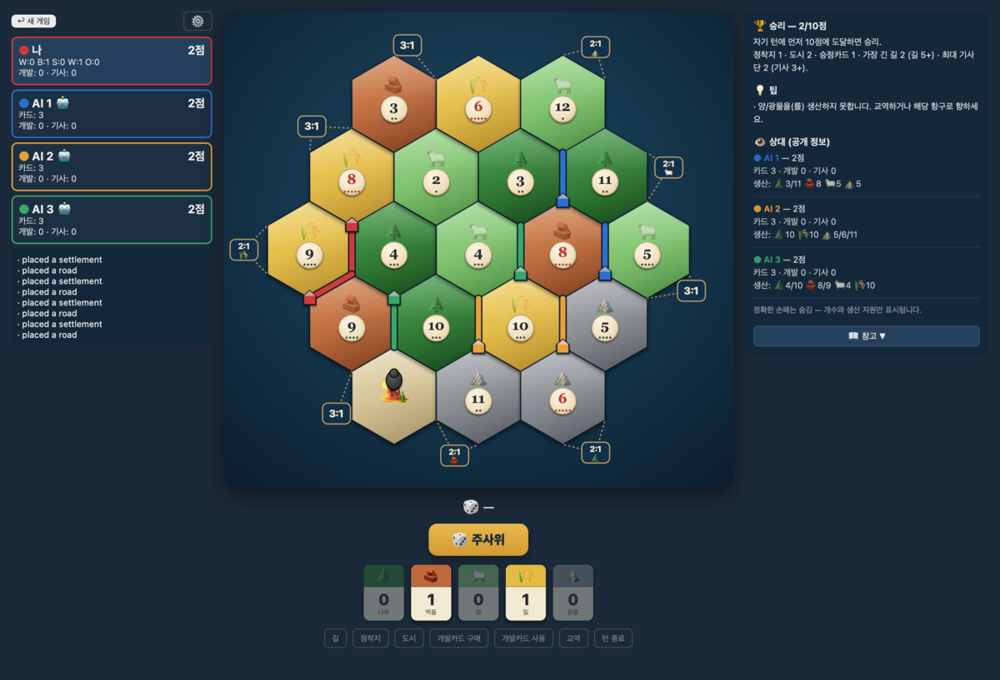

# Hexland

A browser strategy board game — 1 human vs 1–3 heuristic-AI opponents — built on
the classic settle/build/trade hex-island mechanics.

### ▶ Play now: **<https://sciencemj.github.io/hexland/>**



> **Disclaimer:** Hexland is an unofficial fan project. It is **not affiliated with,
> sponsored by, or endorsed by Catan GmbH or Catan Studio**. "Catan" and "Settlers
> of Catan" are trademarks of their respective owners; this project uses none of
> their names, artwork, or branding. Only the (uncopyrightable) game mechanics are
> reimplemented, with original art.

## Run

```bash
bun install
bun run dev      # http://localhost:3000
```

## Test

```bash
bun test         # engine + AI + UI suites
bun run build    # bundle to dist/
```

## Architecture

- `src/engine/` — pure, JSON-serializable game state machine. No DOM/network.
  `getLegalActions` is the single validation gate; `applyAction` returns a new state.
  Seeded RNG makes every game reproducible from its seed.
- `src/ai/` — `Agent` interface + a medium heuristic agent. Swap in MCTS or a
  Claude-MCP agent later without touching the engine.
- `src/ui/` — React + SVG. Renders the engine state; clicks dispatch actions.

### Play with Claude (MCP)

An MCP server (`src/mcp/server.ts`) lets **Claude play Hexland** — it wraps the
engine in `new_game` / `state` / `act` tools and auto-runs the AI seats between
Claude's turns. See **[docs/MCP.md](docs/MCP.md)** to register it (a project
`.mcp.json` is included for Claude Code). Run it standalone with `bun run mcp`.

The engine never imports UI, so the same code also backs a future Bun WebSocket
multiplayer server: load `src/engine`, validate client actions with
`getLegalActions`, apply with `applyAction`, broadcast state. (`tradeOffer` is
intentionally free-form — the offer space is unbounded — so a server/MCP layer
accepts it and lets `applyAction` validate.)

## Rules

Full base game: snake-draft setup, resource production, robber & the 7 (discard at
8+), build roads/settlements/cities, development cards (Knight / Road Building /
Year of Plenty / Monopoly / Victory Point), Longest Road, Largest Army, maritime
(4:1 / 3:1 / 2:1) and player trading, first to 10 VP wins.
